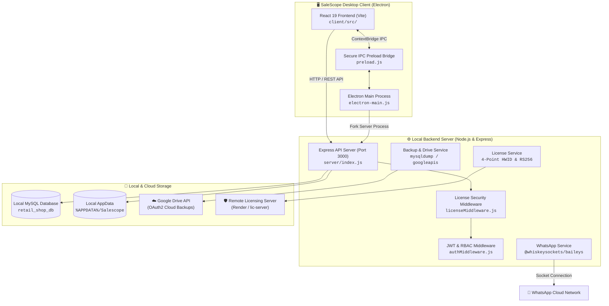
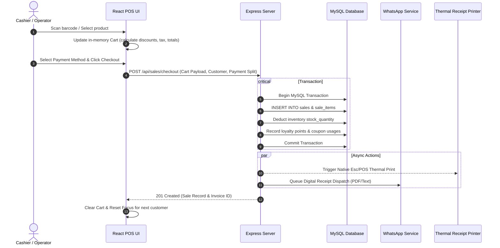
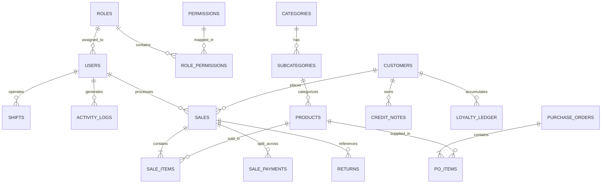

# SaleScope POS 🚀

[](package.json)
[](package.json)
[](package.json)
[](client/package.json)
[](server/package.json)
[](server/db.js)

**SaleScope POS** is an enterprise-grade, offline-first Point of Sale (POS), Inventory Control, WYSIWYG Barcode Label Studio, and Automated WhatsApp CRM desktop system built for modern retail businesses.

Engineered with **Electron**, **React 19**, **Express**, and **MySQL**, SaleScope delivers ultra-low checkout latency, native hardware integration (thermal printers, barcode scanners), automated Google Drive cloud backups, asynchronous WhatsApp digital receipt delivery, and cryptographically verified node-locked software licensing.

---

## 📑 Table of Contents

- [Overview](#-overview)
- [Key Capabilities](#-key-capabilities)
- [System Architecture](#-system-architecture)
- [Tech Stack](#-tech-stack)
- [Repository Structure](#-repository-structure)
- [Prerequisites & Requirements](#-prerequisites--requirements)
- [Installation & Quick Start](#-installation--quick-start)
- [Environment Configuration](#-environment-configuration)
- [Available Scripts](#-available-scripts)
- [API Reference](#-api-reference)
- [Database & Migrations](#-database--migrations)
- [Authentication & Role-Based Access Control](#-authentication--role-based-access-control)
- [Hardware & WhatsApp Integrations](#-hardware--whatsapp-integrations)
- [Software Licensing Architecture](#-software-licensing-architecture)
- [Production Build & Obfuscation](#-production-build--obfuscation)
- [Troubleshooting](#-troubleshooting)
- [Developer Cheat Sheet](#-developer-cheat-sheet)
- [Contributing](#-contributing)
- [License](#-license)

---

## 🌟 Overview

Retail point-of-sale environments demand high reliability, instant responsiveness, and resilience to internet outages. SaleScope addresses these core needs through a local-first architecture:

- **Zero-Latency Checkout**: Local MySQL database caching and optimized queries ensure instant bill creation, print triggering, and stock deduction.
- **Offline Reliability with Cloud Redundancy**: Operate completely offline during business hours; sync encrypted database dumps to Google Drive automatically on schedule or on exit.
- **Automated Customer Re-engagement**: Built-in headless WhatsApp engine (via `@whiskeysockets/baileys`) sends digital PDF receipts, customer loyalty balance alerts, promotional marketing campaigns, and End-of-Day (EOD) sales performance reports to store owners.
- **Professional Labeling**: Integrated **Barcode Studio** provides a drag-and-drop WYSIWYG canvas for designing 1-up and 2-up thermal barcode stickers with fine millimeter calibration and thermal printer hardware profile management.
- **Enterprise Licensing**: Cryptographic node-locked license enforcement using 4-point hardware fingerprinting (Motherboard UUID, CPU ID, C: Drive Volume Serial, MAC address) and RS256 asymmetric signature verification with configurable offline grace periods.

---

## ✨ Key Capabilities

### 🛒 1. Point of Sale & Checkout (POS)
- **Rapid Scanner Processing**: Auto-focus barcode input, instant quantity increment, and sound effects on item scan.
- **Keyboard-First Workflow**: Complete keyboard navigation shortcuts for item search, quantity adjustments, bill holding, and tender selection.
- **Multi-Split Tender**: Accept split payments across Cash, Card, UPI, Store Credit / Credit Notes, and Pay Later.
- **Cart Management**: Hold and resume multiple carts concurrently; apply line-item or invoice-level percentage/fixed discounts.
- **Instant Thermal Bill Printing**: Silent or dialog-based thermal printing with custom store branding, tax invoice layout, return policy notes, and dynamic QR codes.
- **Digital WhatsApp Receipts**: Auto-dispatch digital receipts directly to customer WhatsApp numbers upon checkout.

### 📦 2. Inventory & Stock Control
- **Smart Cataloging**: Manage products with barcode, SKU, category, subcategory, selling price, cost price, and stock levels.
- **Purchase Order (PO) Management**: Generate purchase orders for suppliers, receive incoming shipments, and auto-update inventory quantities and cost prices.
- **Low Stock Alerts**: Configurable stock thresholds with real-time visual warning indicators.
- **Bulk Excel Import/Export**: Bulk import and export product inventories and customer lists using `.xlsx` templates.
- **Visual Pulse Highlighting**: Smooth UI animations highlight recently modified or scanned items in the table.

### 🏷️ 3. Barcode Studio & Thermal Label Designer
- **WYSIWYG Drag-and-Drop Designer**: Interactive canvas supporting dynamic product fields, barcodes (CODE128, EAN-13, etc.), QR codes, custom text, prices, logos, and borders.
- **2-Up & 1-Up Roll Layouts**: Native support for dual-column (2-up) and single-column (1-up) continuous and gap thermal rolls with fine row alignment.
- **Printer Hardware Profiles**: Manage darkness, print speed, DPI (203/300 DPI), gap offsets, and feed directions.
- **Preset Import/Export**: Export label presets as JSON files and share them across store terminals.
- **Batch Print Queue**: Queue multiple inventory items with custom copy counts for bulk printing.

### 💬 4. WhatsApp Automation & Marketing
- **Headless Baileys Engine**: Fast, socket-level WhatsApp Web connection without the heavy overhead of headless Chrome browsers.
- **QR Code Pairing**: Direct QR code scanner modal in the POS UI with auto-reconnect and session persistence in `.baileys_auth`.
- **Bulk Broadcast Campaigns**: Send personalized text and image promotions to segmented customer lists with anti-spam throttle delays.
- **End-of-Day (EOD) Owner Report**: Automatically compiles daily sales totals, net margins, bill counts, and payment breakdowns, then dispatches an executive summary to the owner's WhatsApp on store close.
- **Invalid Number & Blocklist Filter**: Tracks failed dispatches and maintains an automated exclusion list.

### 👥 5. CRM, Loyalty & Credit System
- **Customer Ledger**: Track purchase history, total lifetime spend, visit frequency, and outstanding credit balances.
- **Tiered Loyalty Program**: Configurable points earning rates (fixed per ₹ spent or percentage) and redemption limits per invoice.
- **Promotional Coupons**: Percentage and flat-value coupons with expiry dates, minimum spend constraints, category restrictions, and usage limits.
- **Credit Notes & Return Exchanges**: Issue credit notes with auto-generated alphanumeric codes and expiry tracking for customer returns.

### 📊 6. Analytics, Reports & Expense Tracking
- **Executive Dashboard**: Real-time sales totals, gross revenue, net profit margins, top-selling items, and payment method share charts.
- **Hourly Heatmaps**: Identify peak store traffic and revenue hours.
- **Expense Manager**: Track and categorize daily operational expenses (rent, utilities, salaries, maintenance).
- **Accounting Exports**: One-click Excel export for sales registers, tax breakdowns, and profit/loss statements.

### 🔐 7. Security, Roles & Audit Logging
- **Granular RBAC**: 30+ granular permission gates controlling access to discounts, bill deletion, inventory edits, reports, and system settings.
- **Activity Audit Trail**: Detailed log of all user actions with employee ID, timestamp, IP address, and payload.
- **Shift Management**: Track employee cash registers, start/end shift balances, and register notes.

### ☁️ 8. Automated Cloud Backup & Recovery
- **Local mysqldump Automation**: Automated daily database backups stored in local app data.
- **Google Drive OAuth2 Sync**: Direct cloud synchronization to a dedicated Google Drive folder.
- **Backup & Exit Guard**: Desktop exit dialog prompts users to upload a fresh backup and dispatch the daily report before application termination.

---

## 🏗️ System Architecture

SaleScope POS operates as an Electron desktop application running a local Node.js Express backend and a local MySQL database engine on the host machine.



### Checkout & Printing Lifecycle



---

## 🛠️ Tech Stack

| Layer | Technology | Description |
|---|---|---|
| **Desktop Shell** | Electron `43.2.0` | Desktop wrapper with window lifecycle management, single instance lock, and native dialogs |
| **Frontend Framework** | React `19.2.0` | Modern component UI using React Hooks and Context API |
| **Bundler & Dev Server**| Vite `7.2.4` | High-speed ESM build pipeline and HMR |
| **Routing** | React Router DOM `7.12.0` | Single-page application client routing with lazy chunk loading |
| **UI Styling** | Vanilla CSS / CSS Variables | Modern glassmorphism design system with responsive layouts and micro-interactions |
| **Icons & Charts** | Lucide React, Recharts | Feather-style icons and responsive analytics charting |
| **Barcode & Printing** | `bwip-js`, `react-barcode`, `react-to-print`, `jspdf` | Barcode generation, thermal label rendering, and PDF exports |
| **Backend Framework** | Node.js, Express `5.2.1` | RESTful API server with compression, CORS, and streaming file uploads |
| **Database** | MySQL `8.0+` (`mysql2/promise`) | Relational database engine with transactions and connection pooling |
| **Authentication** | JWT (`jsonwebtoken`), `bcryptjs` | Stateless token authorization and salted password hashing |
| **WhatsApp Engine** | `@whiskeysockets/baileys ^7.0.0-rc13` | Direct WebSocket implementation of WhatsApp Web protocol |
| **Cloud Storage** | `googleapis ^171.0.0` | Google Drive v3 REST API integration for automated backups |
| **Scheduling** | `node-cron ^4.2.1` | Automated cron scheduling for backups and licensing sync |
| **Code Protection** | `javascript-obfuscator`, `bytenode` | AST bytecode compilation and variable/string array obfuscation |
| **Packaging** | `electron-builder ^26.15.3` | Multi-target NSIS Windows installer generation |

---

## 📁 Repository Structure

```text
salescope-pos/
├── .env.example                # Root environment configuration template
├── package.json                # Root package manifest (Electron & packaging scripts)
├── electron-main.js            # Electron main process (lifecycle, server fork, IPC)
├── preload.js                  # Secure context bridge between Electron & React
├── README.md                   # Main project documentation & feature overview
├── SETUP.md                    # Detailed step-by-step installation & database setup guide
├── Salescope.png               # Application branding icon
├── schema.sql                  # Canonical MySQL schema and seed data definition
│
├── client/                     # Frontend React application (Vite)
│   ├── package.json            # Frontend dependencies & scripts
│   ├── vite.config.js          # Vite build & obfuscation configuration
│   ├── index.html              # Single-page application root HTML
│   └── src/
│       ├── App.jsx             # Top-level application routing & security wrappers
│       ├── main.jsx            # React root mount entry point
│       ├── context/            # Context providers (AuthContext, CartContext, ThemeContext)
│       ├── components/         # Reusable UI widgets (Modals, TitleBar, Layout, etc.)
│       ├── pages/              # Primary application screens (POS, Inventory, Sales, etc.)
│       │   ├── BarcodeStudio/  # WYSIWYG Barcode label designer & print engine
│       │   └── Employees/      # Employee management, roles, and permissions
│       ├── styles/             # Modular CSS stylesheets
│       └── utils/              # Client-side utility functions & API helpers
│
├── server/                     # Backend Express API server
│   ├── package.json            # Backend dependencies & scripts
│   ├── .env.example            # Server-specific environment template
│   ├── index.js                # Server entry point, boot profiler & route loader
│   ├── db.js                   # MySQL connection pool configuration
│   ├── paths.js                # Production/Dev path resolution (%APPDATA% mapping)
│   ├── init_schema.js          # Automated database & schema bootstrapper
│   ├── migration_runner.js     # Sequential database migration engine
│   ├── auto-migrate.js         # Automated schema diff & column synchronizer
│   ├── seed.js                 # Default admin account and role seeder
│   ├── middleware/             # Express middlewares (authMiddleware, licenseMiddleware)
│   ├── routes/                 # REST API route handlers (20+ feature modules)
│   ├── services/               # Core business services (WhatsApp, Licensing, Drive, etc.)
│   └── migrations/             # Timestamped incremental database migration files
│
├── lic-server/                 # Dedicated Licensing Server & Admin Portal (Submodule)
│   ├── backend/                # Express & Prisma licensing engine
│   ├── frontend/               # React & Tailwind license admin portal
│   └── docker-compose.yml      # Containerized deployment for licensing server
│
└── scripts/                    # Developer tooling & build automation
    ├── keygen.js               # CLI tool to generate RSA-2048 keypairs & sign licenses
    ├── obfuscate-dist.js       # Production build & JavaScript obfuscation pipeline
    ├── migrate_cost_price.js   # Database utility migration script
    ├── private_key.pem         # Developer private key (sample/signing)
    └── public_key.pem          # Public key for license signature verification
```

---

## 📋 Prerequisites & Requirements

### System Requirements
- **Operating System**: Windows 10 / 11 (64-bit) *(Primary deployment target)*, macOS, or Linux.
- **Node.js**: `v18.18.0` or higher (Node 20+ recommended).
- **Package Manager**: `npm` (v9 or higher).
- **Database Engine**: **MySQL Server 8.0, 8.4 LTS, or 9.0+** running locally on port `3306`.
  - *Note: Ensure `mysqldump` and `mysql` CLI binaries are accessible in your system `PATH` or configured via `MYSQL_BIN_PATH` in `.env`.*

---

## 🚀 Installation & Quick Start

> [!TIP]
> For a comprehensive, step-by-step installation guide with MySQL database troubleshooting, licensing setup, WhatsApp pairing, and hardware printer calibration, see [SETUP.md](file:///e:/newbranch/SETUP.md).

### 1. Clone the Repository
```bash
git clone https://github.com/salescope-software/salescope-pos.git
cd salescope-pos
```

### 2. Install Dependencies
Run `npm install` in the root directory. The `postinstall` hook will automatically install dependencies for both the `server` and `client` workspaces:
```bash
npm install
```

### 3. Configure the Environment
Create your `.env` file in the root and `server/` directory:
```bash
# Windows PowerShell:
Copy-Item .env.example .env
Copy-Item server/.env.example server/.env

# Linux / macOS Bash:
cp .env.example .env
cp server/.env.example server/.env
```

Edit `.env` to match your local MySQL credentials:
```env
PORT=3000
JWT_SECRET=your_secure_random_jwt_secret_key_here

DB_HOST=127.0.0.1
DB_USER=root
DB_PASSWORD=your_mysql_password
DB_NAME=retail_shop_db
MYSQL_BIN_PATH=C:\Program Files\MySQL\MySQL Server 8.0\bin
```

### 4. Database Initialization
You do **not** need to manually import SQL tables. Upon launching the server, SaleScope automatically:
1. Detects if `retail_shop_db` exists (creates it if missing).
2. Executes [schema.sql](file:///e:/newbranch/schema.sql).
3. Applies pending migrations via [migration_runner.js](file:///e:/newbranch/server/migration_runner.js).
4. Seeds the default **Super Admin** account ([seed.js](file:///e:/newbranch/server/seed.js)):
   - **Username**: `admin`
   - **Password**: `admin123`

---

## ⚙️ Environment Configuration

| Variable | Required | Default | Description |
|---|:---:|---|---|
| `PORT` | No | `3000` | Port for the local Express REST API server |
| `JWT_SECRET` | **Yes** | `your_super_secret_jwt_key_here` | Secret key used to sign and verify employee session tokens |
| `DB_HOST` | **Yes** | `127.0.0.1` | Host IP address of the MySQL database |
| `DB_USER` | **Yes** | `root` | MySQL database user |
| `DB_PASSWORD` | **Yes** | — | MySQL database password |
| `DB_NAME` | **Yes** | `retail_shop_db` | Name of the POS database |
| `MYSQL_BIN_PATH` | No | `C:\Program Files\MySQL\MySQL Server 8.0\bin` | Path to MySQL `bin` directory containing `mysqldump.exe` |
| `LIC_SERVER_URL` | No | `https://salescope-api.onrender.com` | Remote licensing server URL for license sync and heartbeats |
| `LIC_SERVER_PUBLIC_KEY` | No | *(Embedded RSA Public Key)* | RS256 public key used to verify digital signatures offline |
| `LIC_VALIDATION_INTERVAL_DAYS` | No | `3` | Frequency (in days) to check license status against the online server |
| `LIC_OFFLINE_GRACE_DAYS` | No | `7` | Allowed offline operation grace period before locking billing features |

> [!CAUTION]
> Never commit `.env`, private keys (`.pem`), or database credentials to version control.

---

## 🏃 Available Scripts

### Development

#### Run Desktop Application (Electron + Server)
Starts Electron and automatically forks the local Express server:
```bash
npm start
```

#### Run Frontend Only (Vite HMR Dev Server)
```bash
cd client
npm run dev
```

#### Run Backend Server Standalone (Nodemon Live Reload)
```bash
cd server
npm run dev
```

### Production Build & Packaging

#### Create Production Windows Installer (NSIS Setup `.exe`)
Runs full Vite build, JavaScript AST obfuscation for server files, and packages via Electron Builder:
```bash
npm run dist
```
*Output installer will be placed in `dist/SaleScope Setup 2.0.7.exe`.*

#### Unpacked Directory Build (Testing binaries without packaging)
```bash
npm run pack
```

### Developer Utilities

#### Generate RSA-2048 Keypair for Licensing
```bash
node scripts/keygen.js --action=generate-keys
```

#### Sign an Offline License Key
```bash
node scripts/keygen.js --action=sign --board="XYZ" --cpu="ABC" --disk="123" --mac="00:11:22:33:44:55" --expiry="2027-12-31" --plan="premium"
```

---

## 🔌 API Reference

The backend exposes a structured REST API under `/api`. Below are key endpoints:

### 🔑 Authentication (`/api/auth`)
| Method | Endpoint | Description | Auth Required |
|---|---|---|:---:|
| `POST` | `/api/auth/login` | Authenticate user & return JWT token | No |
| `GET` | `/api/auth/profile` | Retrieve active employee profile & permissions | Yes |
| `POST` | `/api/auth/change-password` | Update current user's password | Yes |

### 🛡️ Licensing (`/api/license`)
| Method | Endpoint | Description | Auth Required |
|---|---|---|:---:|
| `GET` | `/api/license/status` | Get current machine license validity & days left | No |
| `POST` | `/api/license/activate` | Activate license key with local HWID profile | No |
| `POST` | `/api/license/deactivate` | Deactivate and unlink current machine license | Yes |
| `GET` | `/api/license/hwid` | Get 4-point machine hardware fingerprint | No |

### 🛒 Sales & Checkout (`/api/sales`)
| Method | Endpoint | Description | Auth Required |
|---|---|---|:---:|
| `POST` | `/api/sales/checkout` | Process invoice, deduct stock, credit points | Yes (`pos.checkout`) |
| `GET` | `/api/sales` | List historical sales with pagination & filters | Yes (`sales.view`) |
| `GET` | `/api/sales/:id` | Get detailed bill information and items | Yes (`sales.bill.view`) |
| `POST` | `/api/sales/hold` | Save a held cart for later resumption | Yes (`pos.hold_bill`) |
| `GET` | `/api/sales/held` | Retrieve list of currently held bills | Yes (`pos.resume_bill`) |
| `POST` | `/api/sales/returns` | Process item returns and generate refunds | Yes (`returns.process`) |
| `GET` | `/api/sales/stats` | Retrieve sales totals and payment breakdowns | Yes (`dashboard.view`) |

### 📦 Inventory & Products (`/api/products`)
| Method | Endpoint | Description | Auth Required |
|---|---|---|:---:|
| `GET` | `/api/products` | Retrieve all products with category and stock | Yes (`inventory.view`) |
| `POST` | `/api/products` | Create a new inventory product | Yes (`inventory.product.create`) |
| `PUT` | `/api/products/:id` | Update product details, price, or barcode | Yes (`inventory.product.update`) |
| `DELETE` | `/api/products/:id` | Soft/hard delete inventory product | Yes (`inventory.product.delete`) |
| `GET` | `/api/products/barcode/:barcode`| Instant product lookup by barcode string | Yes (`pos.access`) |
| `POST` | `/api/products/import` | Bulk import products from Excel file | Yes (`inventory.import`) |

### 🏷️ Barcode Studio (`/api/barcode`)
| Method | Endpoint | Description | Auth Required |
|---|---|---|:---:|
| `GET` | `/api/barcode/presets` | Get all saved label design presets | Yes |
| `POST` | `/api/barcode/presets` | Save new WYSIWYG label canvas layout | Yes |
| `GET` | `/api/barcode/profiles` | Get saved thermal printer configuration profiles | Yes |
| `POST` | `/api/barcode/profiles` | Save printer DPI, speed, darkness & gap settings | Yes |

### 💬 WhatsApp Engine (`/api/whatsapp`)
| Method | Endpoint | Description | Auth Required |
|---|---|---|:---:|
| `POST` | `/api/whatsapp/start` | Initialize Baileys socket client | Yes (`whatsapp.connect`) |
| `POST` | `/api/whatsapp/stop` | Disconnect WhatsApp Web session | Yes (`whatsapp.disconnect`) |
| `GET` | `/api/whatsapp/status` | Get connection status (`connected`, `qr_ready`, etc.) | No |
| `GET` | `/api/whatsapp/qr-data` | Retrieve active QR authentication payload | No |
| `POST` | `/api/whatsapp/sendText` | Send direct text message to customer | Yes (`whatsapp.send_bill`) |
| `POST` | `/api/whatsapp/campaign/start` | Launch bulk promotional marketing campaign | Yes (`whatsapp.bulk_message`) |
| `POST` | `/api/whatsapp/campaign/cancel`| Stop active running campaign | Yes (`whatsapp.bulk_message`) |
| `POST` | `/api/whatsapp/campaign/clear` | Clear completed campaign from memory | Yes |

### ☁️ Database & Cloud Backups (`/api/backup`)
| Method | Endpoint | Description | Auth Required |
|---|---|---|:---:|
| `GET` | `/api/backup/list` | List all local `.sql` database backup files | Yes (`backup.view`) |
| `POST` | `/api/backup/create` | Trigger instant `mysqldump` snapshot | Yes (`backup.create`) |
| `POST` | `/api/backup/restore` | Restore database state from selected `.sql` | Yes (`backup.restore`) |
| `GET` | `/api/backup/drive/status` | Check Google Drive OAuth2 connection status | Yes (`backup.drive.sync`) |
| `POST` | `/api/backup/upload-latest` | Upload most recent backup to Google Drive | Yes (`backup.drive.sync`) |

---

## 🗄️ Database & Migrations

### Core Database Entities



### Schema Synchronization Flow
1. **[init_schema.js](file:///e:/newbranch/server/init_schema.js)**: Runs on first boot to create all tables, triggers, and indices defined in `schema.sql`.
2. **[auto-migrate.js](file:///e:/newbranch/server/auto-migrate.js)**: Reads schema definitions and dynamically performs `ALTER TABLE` operations if newer columns or indices are missing. Uses a `.migrate_stamp` caching mechanism to avoid slow InnoDB cold-starts on Windows.
3. **[migration_runner.js](file:///e:/newbranch/server/migration_runner.js)**: Executes ordered JavaScript migration files in `server/migrations/` and tracks execution status in the `_migrations` table.

---

## 🛡️ Authentication & Role-Based Access Control

SaleScope implements an enterprise RBAC model with direct employee permission overrides:

- **Roles Table**: Stores functional groups (e.g. `Super Admin`, `Store Manager`, `Cashier`).
- **Permissions Table**: Defines 40+ granular security keys across all business domains (e.g. `pos.discount.apply`, `inventory.product.delete`, `backup.restore`, `reports.export`).
- **Employee Permissions Table**: Allows store owners to grant or revoke specific granular capabilities for individual employees regardless of their role.

### Permissions Enforcement
Backend routes are guarded using `authMiddleware.js`:
```javascript
router.post('/products', verifyToken, checkPermission('inventory.product.create'), async (req, res) => {
    // Handler logic...
});
```

---

## 🔒 Software Licensing Architecture

SaleScope uses a hybrid node-locked licensing model to protect against unauthorized duplication:

1. **4-Point Hardware Fingerprinting (HWID)**:
   - Motherboard Serial / UUID (`wmic baseboard get serialnumber`)
   - CPU Processor ID (`wmic cpu get processorid`)
   - Primary Disk Volume Serial (`wmic diskdrive get serialnumber`)
   - Physical Network MAC Address (filtering virtual adapters like Hyper-V, WSL, Docker, VPNs)
2. **Asymmetric RS256 Verification**:
   - License tokens are digitally signed by the private key on the remote `lic-server`.
   - The desktop POS validates signatures locally using the embedded RSA-2048 public key.
3. **Node-Locked AES-256 Storage**:
   - Local license payload is encrypted with an AES-256-CBC key derived via `scrypt` from the machine's unique hardware signature.
4. **Anti-Clock-Tampering Guard**:
   - Enforces forward-moving timestamps stored in hidden system metadata (`.salescope_meta.dat`) to prevent users from extending trials by rolling back the system clock.
5. **Configurable Offline Grace Period**:
   - Allows full offline functionality for a grace window (default 3 to 7 days) when store internet connectivity is down.

---

## 📦 Production Build & Obfuscation

SaleScope uses a multi-tier build and obfuscation pipeline to generate clean, protected production executables.

### Build Steps (`npm run dist`)
1. **Client Build**: Compiles React 19 code into optimized static assets with Vite and AST obfuscation (`vite-plugin-javascript-obfuscator`).
2. **Server Staging**: Copies backend files into `dist-obfuscated/server` while stripping logs, temporary caches, and auth tokens.
3. **Production Dependencies**: Runs clean `npm install --omit=dev` inside the staged server distribution directory.
4. **AST Obfuscation**: Transforms backend source code using `javascript-obfuscator` (string array rotation, hexadecimal identifier renaming, control flow protection), while keeping critical boot files performant.
5. **Electron Packaging**: `electron-builder` packages the runtime, frontend assets, obfuscated server resources, and NSIS installer scripts into a single production `.exe`.

---

## 🔧 Troubleshooting

### 1. Database Connection Refused (`ECONNREFUSED` / Error 4078)
- **Cause**: The local MySQL service is stopped or not running on port `3306`.
- **Solution**: Open Windows Services (`services.msc`), locate **MySQL80** (or your MySQL service name), and click **Start**.

### 2. Port 3000 Already in Use (`EADDRINUSE`)
- **Cause**: A previous orphan Node.js or Electron process is still holding port 3000.
- **Solution**: The application automatically kills orphaned processes on startup. To manually free port 3000 on Windows:
  ```powershell
  Get-Process -Id (Get-NetTCPConnection -LocalPort 3000).OwningProcess | Stop-Process -Force
  ```

### 3. WhatsApp QR Code Not Generating / Timeout
- **Cause**: Node.js crypto polyfill missing or corrupted `.baileys_auth` folder.
- **Solution**: Delete the `.baileys_auth` folder located in `%APPDATA%/Salescope/.baileys_auth` (in production) or `server/.baileys_auth` (in development), then restart the app and scan the new QR code.

### 4. License Status "Not Active" / Pending
- **Cause**: License key expired, device revoked from licensing portal, or hardware changed.
- **Solution**: Navigate to `/activation` in the app, copy your machine's HWID, and generate a new key or enroll the machine in the `lic-server` management portal.

---

## ⚡ Developer Cheat Sheet

```bash
# ----------------------------------------------------
# Setup & Installation
# ----------------------------------------------------
git clone https://github.com/salescope-software/salescope-pos.git
cd salescope-pos
npm install                     # Installs root, server, and client dependencies

# ----------------------------------------------------
# Development Mode
# ----------------------------------------------------
npm start                       # Launch Electron Desktop App + Express Server
npm run dev --prefix client     # Launch Vite React Frontend on http://localhost:5173
npm run dev --prefix server     # Launch Express Backend on http://localhost:3000

# ----------------------------------------------------
# Code Quality & Testing
# ----------------------------------------------------
npm run lint --prefix client    # Run ESLint on frontend code

# ----------------------------------------------------
# Production Packaging
# ----------------------------------------------------
npm run dist                    # Build obfuscated binaries and create NSIS Installer
npm run pack                    # Build unpacked directory for inspection

# ----------------------------------------------------
# Licensing CLI Utilities
# ----------------------------------------------------
node scripts/keygen.js --action=generate-keys
node scripts/keygen.js --action=sign --board="BOARD_ID" --cpu="CPU_ID" --disk="DISK_ID" --mac="MAC_ADDR" --expiry="2027-12-31"
```

---

## 🤝 Contributing

We welcome contributions from the community! To contribute:

1. **Fork the Repository** on GitHub.
2. **Create a Feature Branch**:
   ```bash
   git checkout -b feat/my-new-feature
   ```
3. **Commit Your Changes** using Conventional Commits:
   ```bash
   git commit -m "feat(pos): add multi-currency cash tender rounding"
   ```
4. **Push to Your Branch**:
   ```bash
   git push origin feat/my-new-feature
   ```
5. **Open a Pull Request** describing your changes in detail.

---

## 📄 License

This project is licensed under the [ISC License](package.json).  
Copyright © 2026 **SaleScope Software**. All rights reserved.

