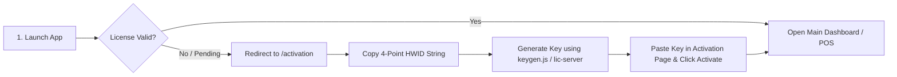

# 🛠️ SaleScope POS — Complete Installation & Setup Guide

This guide provides step-by-step instructions for installing, configuring, deploying, and maintaining **SaleScope POS** on a local development machine or production retail environment.

---

## 📑 Table of Contents

- [1. Prerequisites & System Requirements](#1-prerequisites--system-requirements)
- [2. MySQL Database Setup](#2-mysql-database-setup)
- [3. Project Cloning & Dependencies](#3-project-cloning--dependencies)
- [4. Environment Variables Configuration](#4-environment-variables-configuration)
- [5. Automated Database Initialization](#5-automated-database-initialization)
- [6. Software Licensing Configuration](#6-software-licensing-configuration)
- [7. Running the Application](#7-running-the-application)
- [8. Initial Admin Setup & Store Configuration](#8-initial-admin-setup--store-configuration)
- [9. Optional Hardware & Cloud Integrations](#9-optional-hardware--cloud-integrations)
  - [Google Drive Cloud Backup Setup](#google-drive-cloud-backup-setup)
  - [WhatsApp Automation Engine Pairing](#whatsapp-automation-engine-pairing)
  - [Thermal Receipt & Barcode Label Printer Setup](#thermal-receipt--barcode-label-printer-setup)
- [10. Production Build & NSIS Installer Generation](#10-production-build--nsis-installer-generation)
- [11. Comprehensive Troubleshooting Guide](#11-comprehensive-troubleshooting-guide)

---

## 1. Prerequisites & System Requirements

Before you begin, ensure your host computer meets the following requirements:

### Operating System
- **Windows 10 / 11 (64-bit)** *(Primary supported deployment target)*
- **macOS / Linux** *(Supported for development and API server execution)*

### Core Runtimes & Tools
| Software | Required Version | Download Link / Command |
|---|---|---|
| **Node.js** | `v18.18.0` or higher (Node 20+ LTS recommended) | [nodejs.org](https://nodejs.org/) |
| **npm** | `v9.0.0` or higher | Bundled with Node.js (`npm -v`) |
| **MySQL Server** | `8.0+`, `8.4 LTS`, or `9.0+` | [mysql.com/downloads](https://dev.mysql.com/downloads/mysql/) |
| **Git** | `v2.30.0` or higher | [git-scm.com](https://git-scm.com/) |

### Hardware Prerequisites (Optional / Retail Use)
- **Barcode Scanner**: Standard 1D/2D USB HID Keyboard-emulation scanner.
- **Receipt Printer**: 58mm or 80mm ESC/POS Thermal Receipt Printer with Windows driver.
- **Barcode Label Printer**: Direct Thermal / Thermal Transfer 203 DPI or 300 DPI printer (e.g. Xprinter, Zebra, TSC) for 1-up or 2-up sticker rolls.

---

## 2. MySQL Database Setup

SaleScope uses a high-performance **MySQL** relational database engine (`mysql2/promise`) running locally.

### Step 2.1: Install MySQL Server (Windows)
1. Download the **MySQL Community Server (Windows MSI Installer)** from the official MySQL website.
2. Select **Server only** or **Developer Default**.
3. During the Configuration step:
   - **Port**: Keep the default port `3306`.
   - **Authentication Method**: Select **Use Strong Password Encryption (caching_sha2_password)** or **Legacy Authentication (mysql_native_password)**.
   - **Root Account Password**: Enter a secure password (e.g. `O*999` or your custom password). Record this password for your `.env` configuration.
   - **Windows Service**: Check **Start the MySQL Server at System Startup** (Service Name: `MySQL80` or `MySQL`).

### Step 2.2: Verify MySQL Windows Service is Running
Open **PowerShell as Administrator** and verify that MySQL is active:

```powershell
# Check service status
Get-Service MySQL*

# If stopped, start the service:
Start-Service MySQL80
```

### Step 2.3: Verify `mysqldump` and CLI Binaries
SaleScope automates daily database backups using `mysqldump`. Ensure the MySQL `bin` directory is in your system `PATH` or note its absolute path:

- Default location: `C:\Program Files\MySQL\MySQL Server 8.0\bin`

You can test if `mysql` and `mysqldump` are accessible by running:
```powershell
mysql --version
mysqldump --version
```

---

## 3. Project Cloning & Dependencies

### Step 3.1: Clone the Repository
Clone the repository using Git and navigate into the root directory:

```bash
git clone https://github.com/salescope-software/salescope-pos.git
cd salescope-pos
```

### Step 3.2: Install Dependencies
Run `npm install` in the project root. The project contains a `postinstall` hook that automatically installs all dependencies across the root, `server`, and `client` workspaces:

```bash
npm install
```

*This installs:*
- Root dependencies: `electron`, `electron-builder`, `javascript-obfuscator`, `fs-extra`
- Backend dependencies (`server/`): `express`, `mysql2`, `@whiskeysockets/baileys`, `jsonwebtoken`, `bcryptjs`, `googleapis`, `node-cron`, `multer`, `xlsx`, etc.
- Frontend dependencies (`client/`): `react`, `react-dom`, `vite`, `react-router-dom`, `recharts`, `lucide-react`, `bwip-js`, `react-to-print`, `jspdf`, etc.

---

## 4. Environment Variables Configuration

The application requires environment configuration in both the project root and the `server/` directory.

### Step 4.1: Copy Environment Templates

#### Windows (PowerShell):
```powershell
Copy-Item .env.example .env
Copy-Item server\.env.example server\.env
```

#### Linux / macOS:
```bash
cp .env.example .env
cp server/.env.example server/.env
```

### Step 4.2: Configure `.env` Settings
Open `.env` (and `server/.env`) in your code editor and adjust the settings:

```env
# ── Server Configuration ─────────────────────────────────────────────
PORT=3000
JWT_SECRET=salescope_super_secret_jwt_key_replace_with_random_string_2026

# ── Local Database Configuration ──────────────────────────────────────
DB_HOST=127.0.0.1
DB_USER=root
DB_PASSWORD=your_actual_mysql_root_password
DB_NAME=retail_shop_db
MYSQL_BIN_PATH=C:\Program Files\MySQL\MySQL Server 8.0\bin

# ── Hybrid Licensing Configuration ───────────────────────────────────
# Remote licensing server URL (for online heartbeat / sync)
LIC_SERVER_URL=https://salescope-api.onrender.com

# Asymmetric RS256 Public Key (matches lic-server)
LIC_SERVER_PUBLIC_KEY="-----BEGIN PUBLIC KEY-----\nMIIBIjANBgkqhkiG9w0BAQEFAAOCAQ8AMIIBCgKCAQEAvZ7UoZHo4dYXFliRcG7JZ3iteeKaBReY9mQxjbvmOXpwGUNETKENS82yMdgGIWCAX9heSAmlmgtZ3eds5I53MqYZBnk8YvM/xvvRF4qyoRGyo9L4bz+IB0eDqItA9v2rEEQ3D3bCWIiP8gyBsSn8g1/Y61jv+i7Tu3Q60yg012Hm19uWHwEuWY3rZhR8kMHhDQxheM9C8grB21fI1nTzb01FY4nBIzxQH8NBq9izc6R109ahIjCC7HX/+o+bN0O1uNguhO75SAdVhIVdehzxi+VFtKLjTWYSO0rV2OlIB3fKgwAziorQ3HkGqXHG9GboaXaHTm3Dnar9ndVHyV0uiwIDAQAB\n-----END PUBLIC KEY-----"

# Validation interval (in days) and offline grace window
LIC_VALIDATION_INTERVAL_DAYS=3
LIC_OFFLINE_GRACE_DAYS=7
```

> [!IMPORTANT]
> If your MySQL `root` user password differs from the template, update `DB_PASSWORD` in `.env` and `server/db.js` accordingly.

---

## 5. Automated Database Initialization

SaleScope features an **automatic schema and migration bootstrapper**. You do **not** need to manually import SQL files into MySQL.

When the application boots:
1. **Database Detection**: `server/index.js` connects to MySQL and checks if `retail_shop_db` exists. If not, `init_schema.js` automatically creates it and runs `schema.sql`.
2. **Schema Diff & Column Updates**: `auto-migrate.js` verifies that all table columns, foreign keys, and indexes exist.
3. **Sequential Migrations**: `migration_runner.js` executes any pending migration scripts from `server/migrations/`.
4. **Default Seeding**: `seed.js` inserts default roles, 40+ granular system permissions, and creates the default Super Admin user:
   - **Default Username**: `admin`
   - **Default Password**: `admin123`

---

## 6. Software Licensing Configuration

SaleScope includes a cryptographic 4-point node-locked licensing system that verifies the machine's hardware fingerprint (Motherboard, CPU, Primary Disk Volume, and physical MAC address).



### How to Activate During Development / Staging:

#### Option A: Use the Built-in Developer Keygen CLI
1. Open the `/activation` screen in SaleScope or fetch the local HWID:
   ```bash
   curl http://localhost:3000/api/license/hwid
   ```
2. Generate an RSA-2048 offline signed license key using `scripts/keygen.js`:
   ```bash
   node scripts/keygen.js --action=sign --board="YOUR_BOARD_ID" --cpu="YOUR_CPU_ID" --disk="YOUR_DISK_SERIAL" --mac="YOUR_MAC_ADDR" --expiry="2028-12-31" --plan="premium"
   ```
3. Copy the generated license key from terminal output, paste it into the **License Key** field on the `/activation` page, and click **Activate Software**.

#### Option B: Remote Cloud Licensing Server
If you host a remote licensing API server (e.g., on Render / Cloud), manage customer licenses from your admin portal and activate directly over the internet.

---

## 7. Running the Application

### Mode 1: Desktop Application (Full Electron Environment)
This command launches the Electron desktop shell and automatically forks the local Express server:

```bash
npm start
```

### Mode 2: Standalone Web Development (Browser + Hot Reload)
For rapid frontend UI development with Vite Fast Refresh:

1. **Terminal 1 (Backend API Server with Nodemon)**:
   ```bash
   cd server
   npm run dev
   ```
   *Server listens on `http://localhost:3000`.*

2. **Terminal 2 (Frontend Client with Vite)**:
   ```bash
   cd client
   npm run dev
   ```
   *Frontend opens on `http://localhost:5173` (requests to `/api` proxy automatically to port 3000).*

---

## 8. Initial Admin Setup & Store Configuration

Once the application window opens:

1. **Sign In**:
   - **Username**: `admin`
   - **Password**: `admin123`
2. **Change Default Password**:
   - Go to **Employees** $\rightarrow$ Click on the Admin user $\rightarrow$ Update password to a strong secret.
3. **Configure Store Identity**:
   - Go to **Store Settings** (`/settings/store`).
   - Enter your **Store Name**, **Address**, **Contact Numbers**, **Tax / GST Number**, and **Return Policy Text**.
   - Upload your **Store Logo** (used for thermal receipt print headers) and **Login Screen Logo**.
4. **Create Inventory Categories & Products**:
   - Go to **Categories** (`/categories`) to create your departments.
   - Go to **Inventory** (`/inventory`) or **Quick Add** (`/quick-add`) to add products or import an existing catalog via Excel (`.xlsx`).

---

## 9. Optional Hardware & Cloud Integrations

### Google Drive Cloud Backup Setup
SaleScope allows automatic, encrypted cloud backups of your MySQL database to your personal or store Google Drive account.

1. Go to the [Google Cloud Console](https://console.cloud.google.com/).
2. Create a new project named `SaleScope Backup`.
3. Enable the **Google Drive API** under *APIs & Services $\rightarrow$ Enabled APIs*.
4. Go to *APIs & Services $\rightarrow$ Credentials $\rightarrow$ Create Credentials $\rightarrow$ OAuth client ID*.
   - **Application Type**: Web application
   - **Authorized redirect URIs**: `http://localhost:3000/api/backup/drive/callback`
5. Copy your **Client ID** and **Client Secret**.
6. In SaleScope POS, navigate to **Connect Drive** (`/connect-drive`), paste your Client ID and Client Secret, and click **Connect Google Drive**.
7. Complete the Google OAuth login prompt in your browser.

---

### WhatsApp Automation Engine Pairing
SaleScope integrates `@whiskeysockets/baileys` to communicate directly with WhatsApp Web sockets without requiring Chrome or external paid gateways.

1. Click the **WhatsApp Status** icon in the POS header or navigate to **WhatsApp Bulk** (`/whatsapp-bulk`).
2. Click **Connect WhatsApp**. A QR code modal will appear.
3. Open WhatsApp on your store phone $\rightarrow$ Settings $\rightarrow$ **Linked Devices** $\rightarrow$ **Link a Device**.
4. Scan the QR code on your computer screen.
5. Once connected, session tokens are securely persisted in `.baileys_auth/`.
6. *(Optional)* In **Store Settings**, ensure `phone_1` is set to the store owner's WhatsApp number to enable automated **End-of-Day (EOD) Sales Summary Reports** when closing the application.

---

### Thermal Receipt & Barcode Label Printer Setup

#### 1. Thermal Receipt Printer (58mm / 80mm ESC/POS)
- Install the official Windows printer driver for your thermal receipt printer.
- In Windows Settings $\rightarrow$ Printers & Scanners, set the thermal printer as default (or select it during first print).
- In SaleScope, navigate to **POS** $\rightarrow$ complete a checkout $\rightarrow$ click **Print Bill** to verify margin and layout.

#### 2. Barcode Label Printer (Barcode Studio)
- Navigate to **Barcode Studio** (`/barcodes`).
- Click **Printer Profiles** and configure:
  - **DPI**: `203 DPI` (standard thermal) or `300 DPI` (high resolution).
  - **Print Mode**: `Gap` (for die-cut sticker rolls) or `Continuous`.
  - **Roll Layout**: Choose `1-Up` (single sticker per row) or `2-Up` (dual sticker per row).
- Calibrate the label width and height (e.g. 50mm $\times$ 25mm).
- Drag and drop product fields, barcode objects, QR codes, or store logos onto the canvas.
- Click **Save Preset** or **Test Print**.

---

## 10. Production Build & NSIS Installer Generation

To package SaleScope into a standalone production installer for deployment on client PCs:

### Step 10.1: Run Full Production Build
Execute the production packaging pipeline:

```bash
npm run dist
```

### What this script executes:
1. **Frontend Build**: Executes `npm run build` in `client/` to compile React 19 into optimized static bundles with Vite obfuscation.
2. **Server Staging**: Prepares clean distribution directory in `dist-obfuscated/server` and strips dev dependencies and logs.
3. **Production Dependencies**: Installs `--omit=dev` production dependencies for the staged backend server.
4. **AST Code Obfuscation**: Transforms backend source code via `javascript-obfuscator` with string array rotation, base64 encoding, and identifier hashing.
5. **Electron Builder Packaging**: Bundles the runtime and creates the NSIS Windows installer:
   - **Output Location**: `dist/SaleScope Setup 2.0.7.exe`

### Step 10.2: Installing on Client Machines
1. Copy `SaleScope Setup 2.0.7.exe` to the target Windows computer.
2. Run the installer and follow the setup wizard.
3. Ensure MySQL Server is installed and running on the target computer.
4. Launch **SaleScope POS** from the Desktop shortcut.

---

## 11. Comprehensive Troubleshooting Guide

### ❌ Problem 1: `Cannot connect to MySQL (ECONNREFUSED / Error -4078)`
- **Cause**: MySQL Server service is not running or listening on port `3306`.
- **Solution**:
  1. Open Windows Run dialog (`Win + R`), type `services.msc`, and press Enter.
  2. Find **MySQL80** (or your custom MySQL service name).
  3. Right-click $\rightarrow$ **Start** (or Restart).
  4. Verify connection using MySQL Workbench or `mysql -u root -p`.

---

### ❌ Problem 2: `MySQL access denied for user 'root'@'127.0.0.1' (Error 1045)`
- **Cause**: The password specified in `.env` or `server/db.js` does not match the actual MySQL root password.
- **Solution**:
  1. Open `server/db.js` and `.env`.
  2. Update `password` field to match your exact MySQL root password.
  3. If you forgot your root password, reset it using the MySQL password reset procedure:
     ```sql
     ALTER USER 'root'@'localhost' IDENTIFIED BY 'YourNewPassword123!';
     FLUSH PRIVILEGES;
     ```

---

### ❌ Problem 3: `Port 3000 is already in use (EADDRINUSE)`
- **Cause**: A previous instance of the Node.js server was not properly terminated.
- **Solution**:
  - Kill the process holding port 3000 in PowerShell:
    ```powershell
    Get-Process -Id (Get-NetTCPConnection -LocalPort 3000).OwningProcess | Stop-Process -Force
    ```

---

### ❌ Problem 4: `WhatsApp QR Code fails to load or loops indefinitely`
- **Cause**: Corrupted session keys in the local auth store.
- **Solution**:
  1. Close the application.
  2. Delete the `.baileys_auth` folder:
     - Development: `server/.baileys_auth`
     - Production: `%APPDATA%\Salescope\.baileys_auth`
  3. Re-launch SaleScope and scan the newly generated QR code.

---

### ❌ Problem 5: `mysqldump: command not found during backup`
- **Cause**: MySQL command-line tools are not registered in system `PATH`.
- **Solution**:
  - Specify the explicit binary directory in `.env`:
    ```env
    MYSQL_BIN_PATH=C:\Program Files\MySQL\MySQL Server 8.0\bin
    ```

---

### ❌ Problem 6: `License shows 'Not Active' or 'Grace Period Expired'`
- **Cause**: The software license has expired or machine hardware has changed.
- **Solution**:
  1. Click the small exclamation mark `!` or go to `/activation`.
  2. Copy your machine's **Hardware ID (HWID)**.
  3. Generate an updated key using `node scripts/keygen.js --action=sign ...` and activate.

---

## 📞 Support & Maintenance

For technical inquiries, bug reports, or feature requests:
- **Repository Issues**: [GitHub Issues](https://github.com/salescope-software/salescope-pos/issues)
- **Maintainers**: SaleScope Core Engineering Team
- **License**: ISC License — Copyright © 2026 SaleScope Software.
